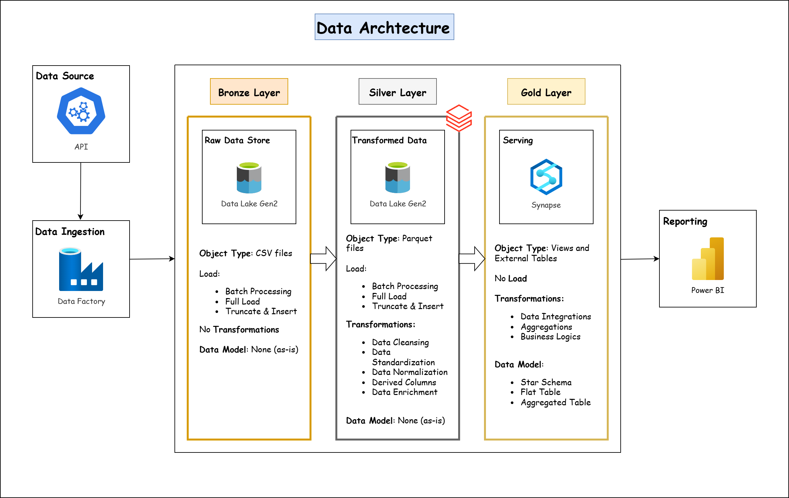
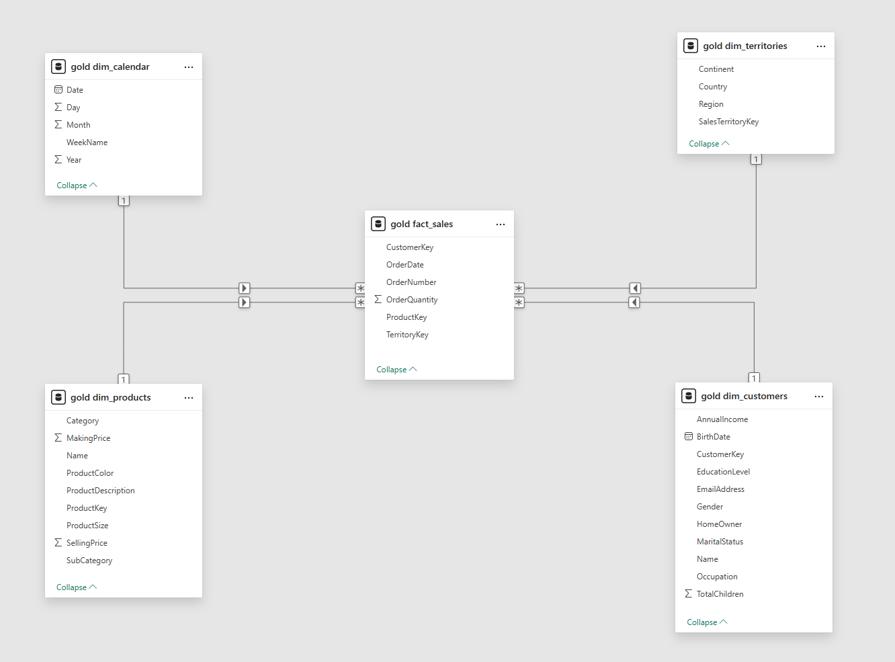
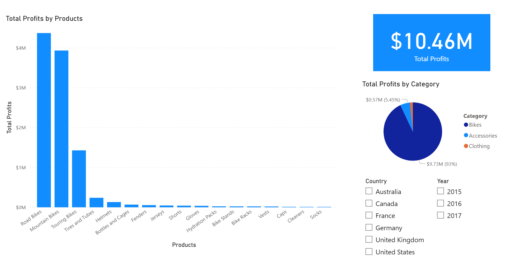

# 🚀 Azure Data Engineering Project

An end-to-end data pipeline built on **Azure**, implementing the **Lakehouse architecture** (Bronze → Silver → Gold) using **Azure Data Factory, Azure Data Lake Gen2, Azure Databricks (PySpark), Synapse Analytics**, and **Power BI**.

---

## 

## 📌 a) Project Architecture

```
API Source → ADF (Ingestion) → ADLS Gen2 (Bronze)
          → Databricks (PySpark Transformations) → ADLS Gen2 (Silver)
          → Synapse External Tables (Gold) → Power BI (Reporting)
```
> 📸 

---

## 📊 b) Dataset

This project uses the **AdventureWorks** [dataset](https://www.kaggle.com/datasets/ukveteran/adventure-works) (via Kaggle) — a realistic, structured dataset for enterprise analytics, focused on retail, production, and sales.

---

## 📥 Data Source

- **Dataset**: Adventure Works from Kaggle
- **Type**: Structured relational CSV tables, split by schema
- **Domain**: Enterprise sales, manufacturing, and finance

---

## ⚙️ How Data Flows Through the Pipeline

### 🟤 Bronze Layer
- Raw CSV ingestion from source directly into ADLS Gen2, preserving relational granularity

### ⚪ Silver Layer
- Databricks (PySpark) transforms:
  - Clean and normalize data (e.g., dates/formats)
  - Join related tables (e.g., sales)
  - Convert CSVs to Parquet format

### ✨ Gold Layer
- Structured tables in ADLS Gen2 for Synapse queries:
  - External tables on curated parquet data by domain
  - Partitioning by date and category for performance

---

## 🔧 c) Technologies Used

- **Azure Data Factory** – For data ingestion and orchestration
- **Azure Data Lake Storage Gen2** – Central storage layer (Bronze, Silver, Gold)
- **Azure Databricks (PySpark)** – Data transformation, cleaning, and processing
- **Azure Synapse Analytics** – Data warehouse layer and external tables
- **Power BI** – For dashboards and final data visualization

---

## 💡 d) Features

- Ingests JSON data from external API using ADF
- Stores raw data in Bronze layer (ADLS)
- Cleans and transforms data using PySpark in Databricks (Silver)
- Final curated data stored in Synapse (Gold)
- External tables and `OPENROWSET()` used for querying
- Dashboards in Power BI connected to Synapse

---

## 📂 e) Project Structure

```
/data-pipeline-project/
├── datasets/             # CSV files from API
├── images/               # Architecture and Data Model
├── powerbi/              # Power BI .pbix file and screenshots
├── synapse/              # SQL scripts for external tables, queries
└── README.md             # This file
```


---

## 📈 f) Data Flow Summary

| Layer   | Tool         | Purpose                               |
|---------|--------------|----------------------------------------|
| Bronze  | ADLS Gen2    | Raw API data storage                  |
| Silver  | Databricks   | Cleaned, structured data (PySpark)    |
| Gold    | Synapse SQL  | Curated data for reporting            |
| Report  | Power BI     | Visualization & KPI tracking          |

---

## g) Data Model

📸 

## h) Visualizations

📸 


